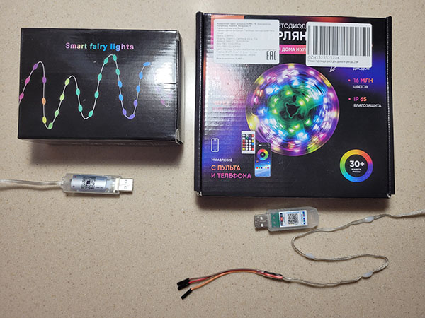
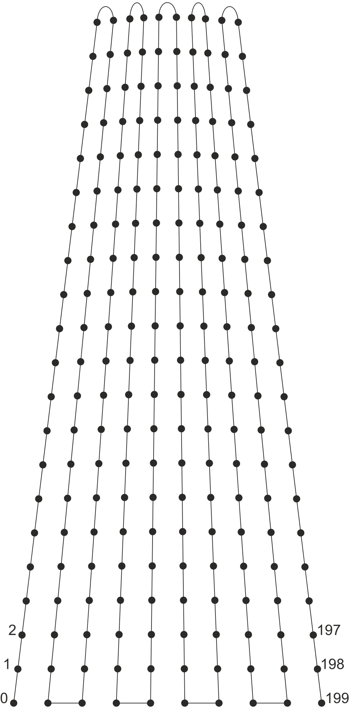
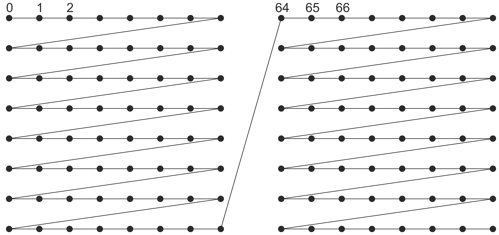
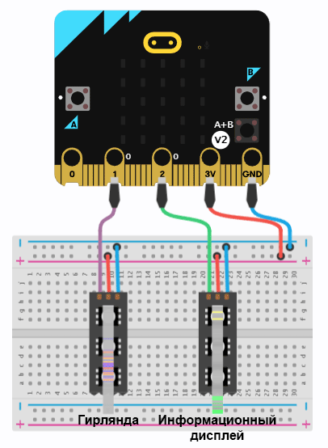
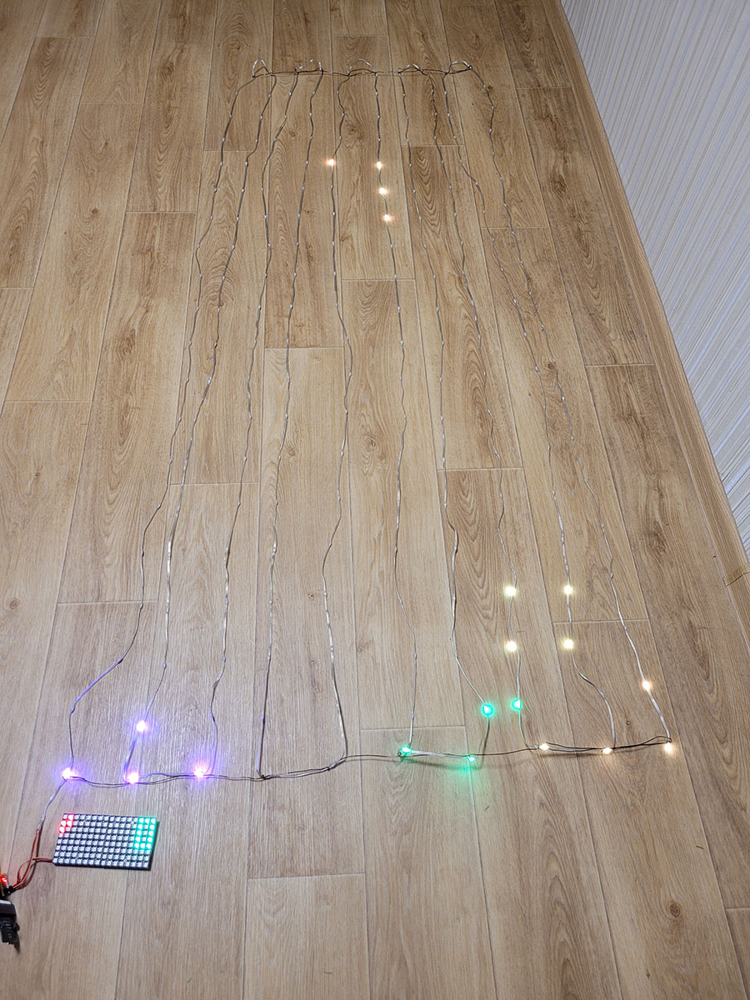
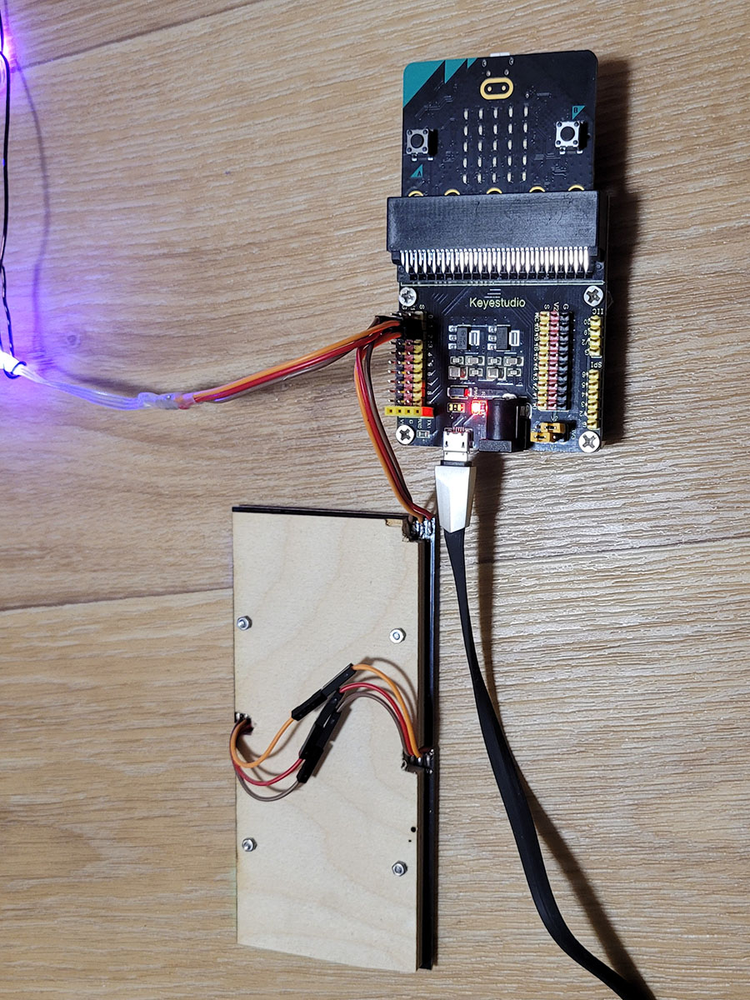
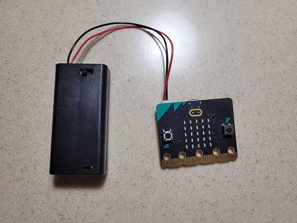

> Открыть эту страницу в [https://a-iv.github.io/christmas-string-tetris/](https://a-iv.github.io/christmas-string-tetris/)

Тетрис прямо на новогодней ёлке.

## Что потребуется

### Микроконтроллер BBC micro:bit V2

Чтобы загрузить проект на микроконтроллер, необходимо:

* Открыть [https://makecode.microbit.org/](https://makecode.microbit.org/).
* Нажать на **Импорт**, затем **Импорт URL**.
* Вставить **https://github.com/a-iv/christmas-string-tetris** и нажать **Вперед!**.
* Подключить BBC micro:bit V2 и нажать **Скачать**.

### Адресная RGB гирлянда WS2812B на 200 диодов

Для отображения игрового поля я использовал адресную RGB гирлянду WS2812B. Но вместо гирлянды можно использовать и
обычную светодиодную ленту WS2812B.

Очевидно, что не все гирлянды с возможностью управления отдельными RGB диодами будут WS2812B.
Но две разные гирлянды, купленные мной в разных магазинах оказались WS2812B.

От гирлянды был отрезан USB контроллер управления и для удобства припаяны перемычки dupont 2.54mm.
Но можно воспользоваться и обычными крокодилами.

### Питание

Продавец заявляет, что гирлянде вместе с USB контроллером необходимо 5V 2А.
На практике при включении на 100% всех RGB светодиодов моя гирлянда потребляет 1.2A.
Для удобства подключения и питания я использовал Keyestudio micro:bit Sensor Shield V2, который через MicroUSB кабель
был подключен к 2A USB блоку питания.

На самом деле гирлянда работает (хоть и не на полную яркость) даже если её подключить к 3V и GND самого
микроконтроллера. Но такую схему подключения я НЕ рекомендую.

### Крепление

Для выравнивания игрового поля снизу и сверху я закрепил гирлянду на эмаль-провод ПЭТВ-2 1.06мм.
Но можно использовать и любой другой способ крепления.

Расстояние между диодами в моей гирлянде составляет 10см. В одном столбце размещается 20 светодиодов, т.о. высота поля
составляет 2 метра. При монтаже расстояние между диодами снизу я оставил 10см, т.о. ширина поля - 1 метр.
Сверху расстояние было уменьшено до 5см, что позволило повторить форму ёлки.

Схема монтажа гирлянды:

### Управление

* Нажатие кнопки A - переместить фигуру влево.
* Нажатие кнопки B - переместить фигуру вправо.
* Одновременное нажатие A и B - сбросить фигуру вниз.
* Нажатие на логотип - повернуть фигуру по часовой стрелке.
* Поворот micro:bit экраном вниз - пауза.
* Поворот micro:bit экраном вверх - возобновить игру.

### Радиоуправление (опционально)

Для дистанционного управления опционально можно использовать второй BBC micro:bit V2 и установить на него
https://github.com/a-iv/christmas-string-tetris-remote-control

Чтобы пульт был полностью автономным, рекомендую использовать комплект BBC micro:bit V2 Go с батарейным отсеком.
Или собрать свой.

### Информационный дисплей со следующей фигурой и счетом (опционально)

Для отображения следующей фигуры и текущего счета можно подключить 2 панели светодиодов 8x8 WS2812B.
Но проект будет корректно работать и без этих панелей.

Схема сборки панелей:

### Сборка

Принципиальная схема:

Как это выглядит:

Пульт:

#### Метаданные (используются для поиска, рендеринга)

* for PXT/microbit

